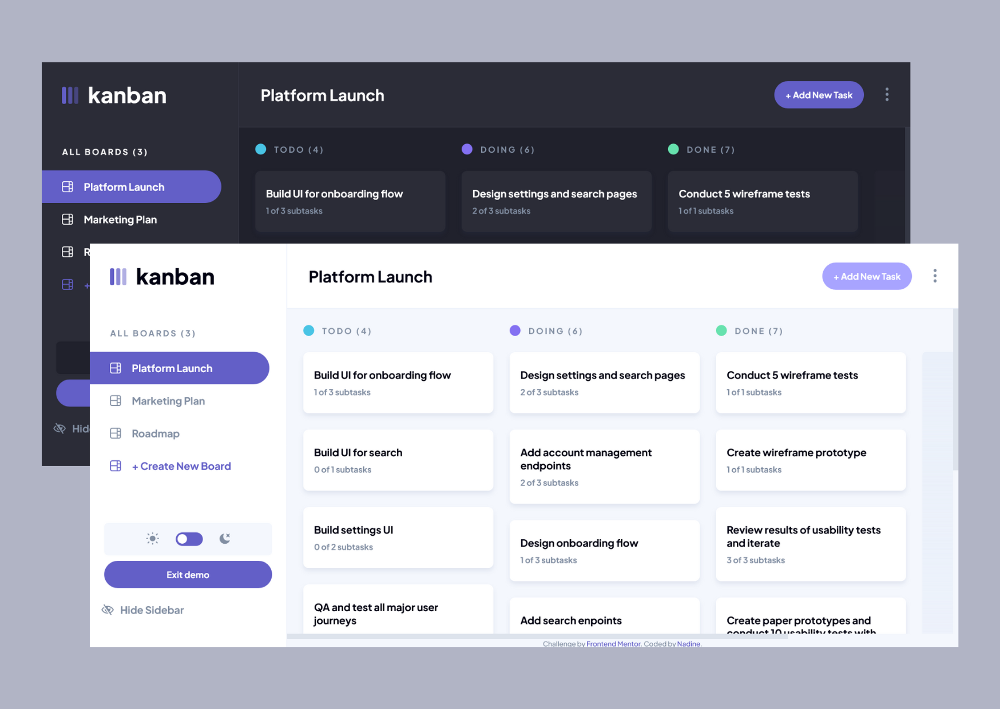

# Kanban task management full stack web app

This is a full stack web app allowing authenticated users to manage their projects and tasks in Kanban boards. The design is adapted from the [Kanban task management web app challenge on Frontend Mentor](https://www.frontendmentor.io/challenges/kanban-task-management-web-app-wgQLt-HlbB).

**Work in progress**: interaction with backend is still buggy.

- Solution URL: [https://github.com/nadlgit/kanban-task-app](https://github.com/nadlgit/kanban-task-app)
- Live Site URL: [https://nadl-kanban-task-app.netlify.app](https://nadl-kanban-task-app.netlify.app) or directly demo page [https://nadl-kanban-task-app.netlify.app/demo](https://nadl-kanban-task-app.netlify.app/demo)

## Context

### The Frontend Mentor challenge

Users should be able to:

- View the optimal layout for the app depending on their device's screen size
- See hover states for all interactive elements on the page
- Create, read, update, and delete boards and tasks
- Receive form validations when trying to create/edit boards and tasks
- Mark subtasks as complete and move tasks between columns
- Hide/show the board sidebar
- Toggle the theme between light/dark modes
- **Bonus**: Allow users to drag and drop tasks to change their status and re-order them in a column
- **Bonus**: Keep track of any changes, even after refreshing the browser (`localStorage` could be used for this if you're not building out a full-stack app)
- **Bonus**: Build this project as a full-stack application

### Additional challenge

Users should be able to:

- Register, log in and log out
- Drag and drop columns to re-order them
- Drag and drop projects to re-order them

Project should:

- Follow [clean architecture](https://blog.cleancoder.com/uncle-bob/2012/08/13/the-clean-architecture.html) principles
- Respect some accessibility guidelines

## Built with

- [Next.js framework](https://nextjs.org/)
- [Typescript](https://www.typescriptlang.org/)
- Backend: [Firebase Authentication](https://firebase.google.com/products/auth) and [Firebase Cloud Firestore](https://firebase.google.com/products/firestore)
- Responsive design with mobile-first workflow
- Semantic HTML5 markup
- Tested with [Jest](https://jestjs.io/), [Testing Library](https://testing-library.com/) and [Faker](https://fakerjs.dev/)

Additional librairies:

- [React Hook Form](https://react-hook-form.com/) and [yup](https://github.com/jquense/yup) for form validation
- [Ariakit](https://ariakit.org/) for some components such as modals
- [react-beautiful-dnd (rbd)](https://github.com/atlassian/react-beautiful-dnd) for drag and drop
- [react-hot-toast](https://react-hot-toast.com/) for notifications
- [react-error-boundary](https://github.com/bvaughn/react-error-boundary)
